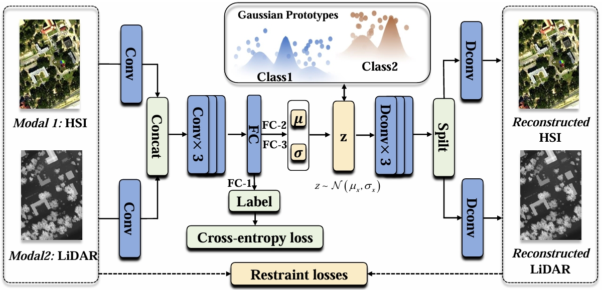
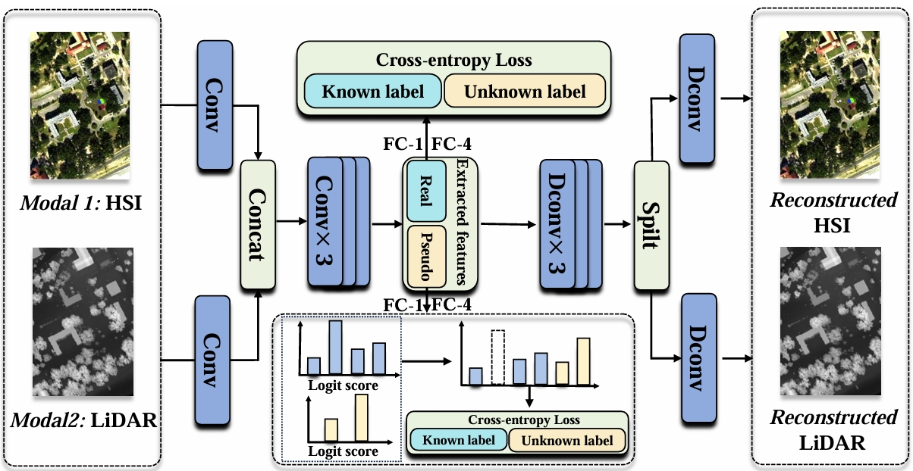

# HyLiOSR: Staged Progressive Learning for Joint Open-Set Recognition of Hyperspectral and LiDAR Data, TGRS, 2025

[Bobo Xi](https://scholar.google.com/citations?user=O4O-s4AAAAAJ&hl=zh-CN), [Mingshuo Cai](https://cfcys.github.io/), [Jiaojiao Li](https://scholar.google.com/citations?user=Ccu3-acAAAAJ&hl=zh-CN&oi=sra), [Zhengjue Wang](https://scholar.google.com/citations?user=qTQj_I4AAAAJ&hl=zh-CN), [Shou Feng](https://homepage.hrbeu.edu.cn/web/fengshou), [Yunsong Li](https://dblp.uni-trier.de/pid/87/5840.html), and [Jocelyn Chanussot](https://jocelyn-chanussot.net/).

**Code for the paper:** [HyLiOSR: Staged Progressive Learning for Joint Open-Set Recognition of Hyperspectral and LiDAR Data](https://ieeexplore.ieee.org/document/待定).





Fig. 1. The Two-stage pipline of the HyLiSOR


# Dataset

* You can download the dataset in [google drive](https://drive.google.com/drive/folders/1g5UPMyqqoKzFZFwyxx-0ji8oaDD5_EfM?usp=drive_link)!

* Then put the dataset in `data/`

# Setup

```bash
git clone XXX
cd HyLiOSR

conda create --name HyLiOSR -y python=3.8
conda activate VHAP

pip3 install torch torchvision torchaudio --index-url https://download.pytorch.org/whl/cu118

cd req\limr-0.1.9
pip install .

python demo.py
```


# References
--

If you find this code helpful😊, please kindly cite:


or you can give me ⭐!

Citation Details
--

BibTeX entry:


Licensing
--

Copyright (C) 2025
