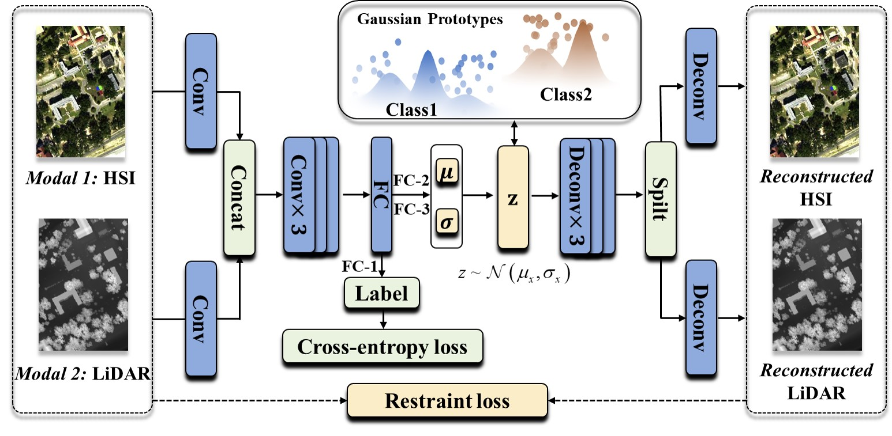
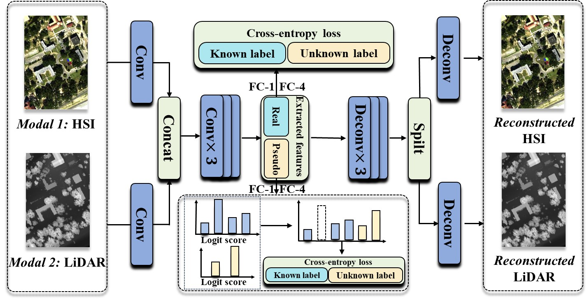

# HyLiOSR: Staged Progressive Learning for Joint Open-Set Recognition of Hyperspectral and LiDAR Data, TGRS, 2025

[Bobo Xi](https://scholar.google.com/citations?user=O4O-s4AAAAAJ&hl=zh-CN), [Mingshuo Cai](https://cfcys.github.io/), [Jiaojiao Li](https://scholar.google.com/citations?user=Ccu3-acAAAAJ&hl=zh-CN&oi=sra), [Zhengjue Wang](https://scholar.google.com/citations?user=qTQj_I4AAAAJ&hl=zh-CN), [Shou Feng](https://homepage.hrbeu.edu.cn/web/fengshou), [Yunsong Li](https://dblp.uni-trier.de/pid/87/5840.html), and [Jocelyn Chanussot](https://jocelyn-chanussot.net/).

**Code for the paper:** [HyLiOSR: Staged Progressive Learning for Joint Open-Set Recognition of Hyperspectral and LiDAR Data](http://doi.org/10.1109/TGRS.2025.3545926).





Fig. 1. The Two-stage pipeline of the proposed HyLiSOR


# Dataset

* You can download the dataset in [google drive](https://drive.google.com/drive/folders/1g5UPMyqqoKzFZFwyxx-0ji8oaDD5_EfM?usp=drive_link)!

* Then put the dataset in `data/`

# Setup

```bash
git clone https://github.com/B-Xi/TGRS_2025_HyLiOSR.git
cd HyLiOSR

conda create --name HyLiOSR -y python=3.8
conda activate HyLiOSR

pip3 install torch torchvision torchaudio --index-url https://download.pytorch.org/whl/cu118

cd req\limr-0.1.9
pip install.

python demo.py
```


# References

If you find this code helpful😊, please kindly cite:

Bobo Xi, Mingshuo Cai, Jiaojiao Li, Zhengjue Wang, Shou Feng, Yunsong Li, Jocelyn Chanussot, "HyLiOSR: Staged Progressive Learning for Joint Open-Set Recognition of Hyperspectral and LiDAR Data," IEEE Transactions on Geoscience and Remote Sensing, vol. 63, pp. 1-15, 2025. DOI: 10.1109/TGRS.2025.3545926.

or you can give me a ⭐!

# BibTeX entry:
```
@ARTICLE{TGRS_2025_HyLiOSR,
  author={Xi, Bobo and Cai, Mingshuo and Li, Jiaojiao and Wang, Zhengjue and Feng, Shou and Li, Yunsong and Chanussot, Jocelyn},
  journal={Transactions on Geoscience and Remote Sensing}, 
  title={HyLiOSR: Staged Progressive Learning for Joint Open-Set Recognition of Hyperspectral and LiDAR Data}, 
  year={2025},
  volume={63},
  number={},
  pages={1-15},
  doi={10.1109/TGRS.2025.3545926}}
```

# Licensing
Copyright (C) 2025 Bobo Xi, Mingshuo Cai 

This program is free software: you can redistribute it and/or modify it under the terms of the GNU General Public License as published by the Free Software Foundation, version 3 of the License.

This program is distributed in the hope that it will be useful, but WITHOUT ANY WARRANTY; without even the implied warranty of MERCHANTABILITY or FITNESS FOR A PARTICULAR PURPOSE. See the GNU General Public License for more details.

You should have received a copy of the GNU General Public License along with this program.

